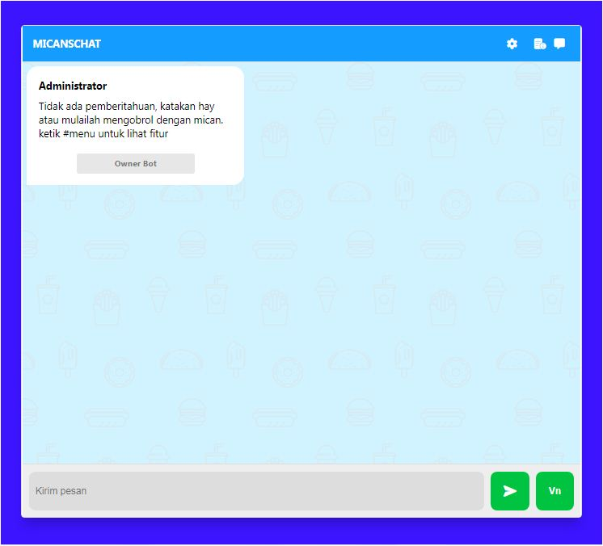
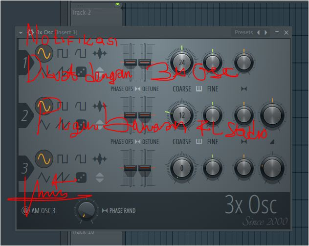

<h2>webchat-API-mican</h2>
<p>Versi beta 1.4.4</p><br>

<p align="left">

</p>
<p>aplikasi berbasis web dilengkapi AI intelegent nembak simsimi, template by sajadhsm
kalo ingin menambahkan fitur silahkan tambahkan sendiri, kalo gabisa tunggu update terbaru</p><br>


- [DOWNLOAD NODEJS](https://nodejs.org)
## Instalasinya

```bash
> cd webchat-api-mican
> git clone https://github.com/vikodk67/webchat-API-mican.git
> npm install
> node run
```
## localhost:8080
<strong>FITUR:</strong>

|     Command     |              Feature                                                                         |
| :-------------: | :------------------------------------------------------------------------------------------: |
|       #play     | menyetel lagu di webnya anda tinggal ketik #play tanpa tambahan lainnya                      |
|       #play4   | ngplay video dari youtube bebas dari iklan                                                    |
|       #tiktok   | mengdonlot:V video sumber dari tiktok anda tinggal ketik #tiktok tanpa tambahan lainnya      |
|       #cerpen   | menceritakan kisah dongeng cerpen jomblo bucin, horor, mesum, mesra, ceria, menyedihkan, dll | 
|       tombol vn   |mengkonversi micropone ke teks pesan akan disampaikan | 

</img>

## SOUND FX / NOTIFICATION
BY FL STUDIO 20
</img>

## APIKEY REKOMENDASI
- [VHTEAR](https://api.vhtear.com)
- [VIKO-API](https://viko-api.herokuapp.com/)
- [VIKOAPI-INDEX](https://vikoapi-index.herokuapp.com/)
- [ZEKS API](https://zeks.xyz/)

## 🙏 Thanks To
* [`Sajadhsm`](https://github.com/sajadhsm) 
* [`Vinz`](https://github.com/myvinz) 
* [`ArugaZ`](https://github.com/ArugaZ/)
* Dan lainnya
